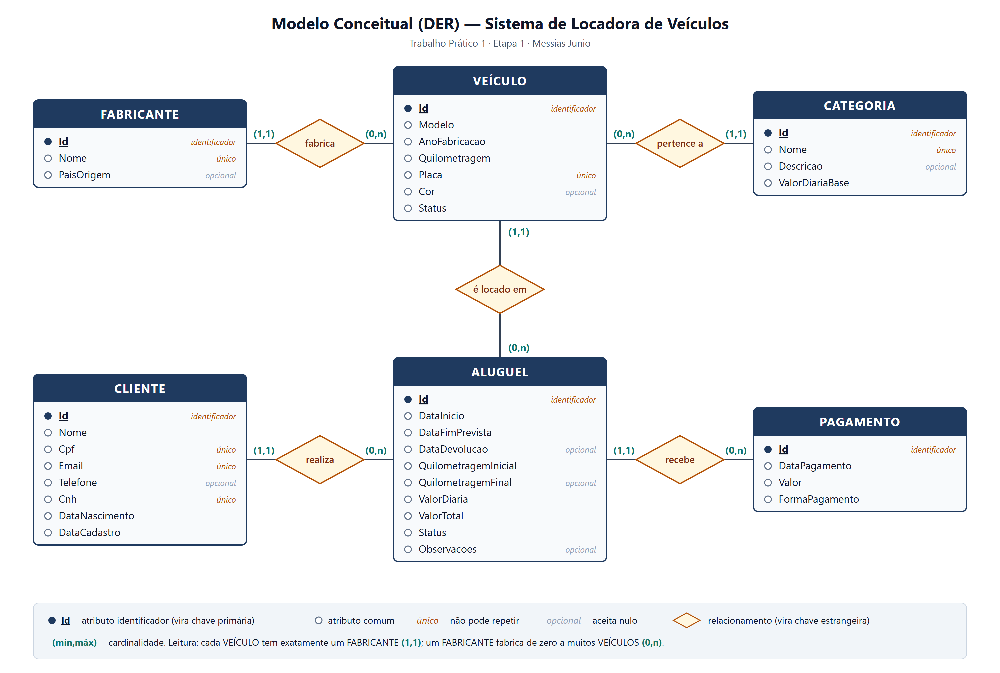
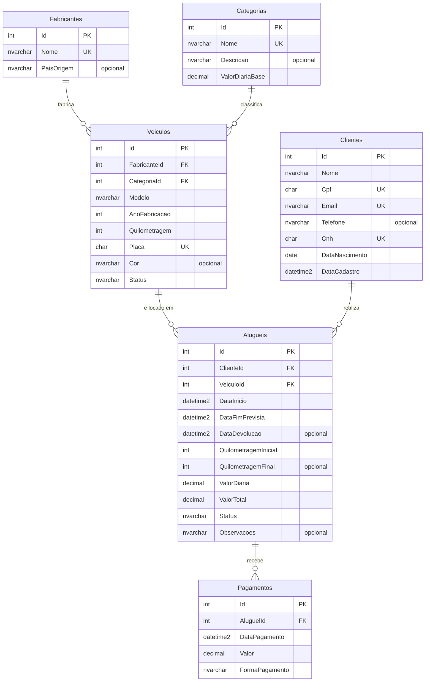
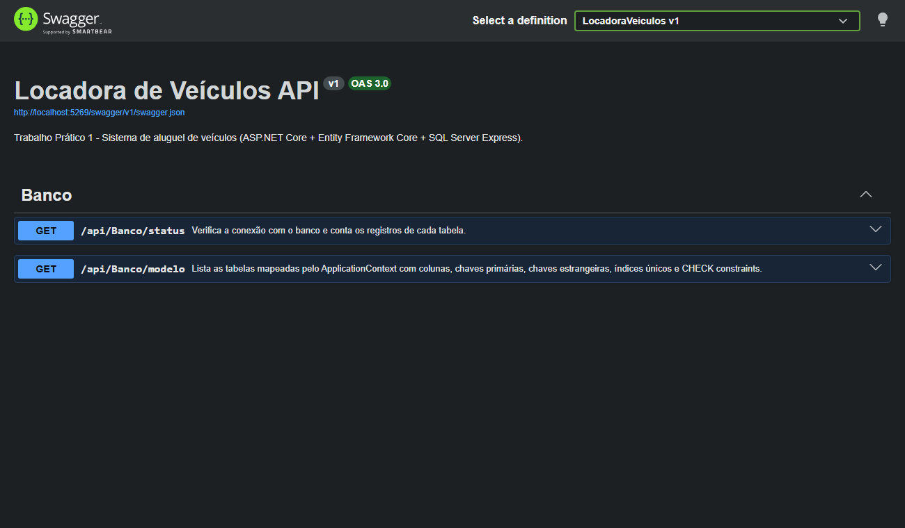

# Locadora de Veículos — Trabalho Prático 1

**Etapa 1 — Modelagem do Banco de Dados**

| | |
|---|---|
| **Aluno** | Messias Junio |
| **Disciplina** | Tecnologias para Análise e Desenvolvimento de Sistemas — PUC Minas (2026/2) |
| **Professor** | Ramon Lacerda Marques |
| **Tema** | Sistema de aluguel de veículos com C#, ASP.NET Core, Entity Framework Core, SQL Server Express e Swagger |

---

## 1. Sobre o projeto

API de uma locadora de veículos. Nesta primeira etapa foi construída a **base de dados** do sistema:
o modelo conceitual, as classes de entidade em C# (camada *Model*), a classe `ApplicationContext`
que mapeia essas classes para o **SQL Server Express** usando o **Entity Framework Core** e a
*migration* que cria o esquema relacional com todas as chaves e restrições de integridade.

## 2. Tecnologias

- C# 14 / .NET 10 (ASP.NET Core Web API com Controllers)
- Entity Framework Core 10 (`Microsoft.EntityFrameworkCore.SqlServer`) — abordagem *Code First* com *Migrations*
- SQL Server Express (instância `localhost\SQLEXPRESS`)
- Swagger (Swashbuckle) para documentação e testes

## 3. Onde está cada requisito da Etapa 1

| Requisito | Onde foi atendido |
|---|---|
| **1.1** Modelo conceitual com Veículo, Fabricante, Cliente, Aluguel etc. | [Seção 4](#4-modelo-conceitual-der) e [`docs/modelo-conceitual.png`](docs/modelo-conceitual.png) |
| **1.2** Entity Framework traduzindo o modelo em esquema relacional | [`Data/ApplicationContext.cs`](LocadoraVeiculos/Data/ApplicationContext.cs), [`Migrations/`](LocadoraVeiculos/Migrations) e o DDL gerado em [`docs/script-criacao-banco.sql`](docs/script-criacao-banco.sql) |
| **1.3** Chaves primárias, estrangeiras e outras restrições | `[Key]` e `[ForeignKey]` nas classes + Fluent API no `ApplicationContext` (UNIQUE, CHECK, DEFAULT, regras de exclusão) — detalhes em [`docs/modelagem-banco-de-dados.md`](docs/modelagem-banco-de-dados.md) |
| **1.4** Classes de entidade em C# | Pasta [`Models/`](LocadoraVeiculos/Models) |
| **1.5** No mínimo 5 entidades | **6 entidades**: Fabricante, Veículo, Cliente, Aluguel + **Categoria** e **Pagamento** |

## 4. Modelo conceitual (DER)



### Regras de negócio do enunciado

| Regra | Como o modelo garante |
|---|---|
| Todo veículo pertence a um fabricante e registra modelo, ano de fabricação e quilometragem | `Veiculo.FabricanteId` é FK **obrigatória**; `Modelo`, `AnoFabricacao` e `Quilometragem` são `NOT NULL` |
| O cliente tem pelo menos nome, CPF e e-mail | `Cliente.Nome`, `Cpf` e `Email` obrigatórios; CPF e e-mail com índice **único** |
| Todo aluguel está atrelado a um cliente e a um veículo em um período de tempo | `Aluguel.ClienteId` e `Aluguel.VeiculoId` (FKs obrigatórias) + `DataInicio` e `DataFimPrevista` |
| Registrar a devolução, a quilometragem inicial e final, o valor da diária e o valor total | `DataDevolucao`, `QuilometragemInicial`, `QuilometragemFinal`, `ValorDiaria` e `ValorTotal` |

## 5. Modelo lógico (relacional)



O dicionário de dados completo (tipos, obrigatoriedade e todas as restrições) está em
[`docs/modelagem-banco-de-dados.md`](docs/modelagem-banco-de-dados.md).

## 6. Como executar

**Pré-requisitos:** [.NET SDK 10](https://dotnet.microsoft.com/download) e SQL Server Express (instância `SQLEXPRESS`).

```bash
git clone https://github.com/MessiasJr14/Trabalho-Pr-tico-1---Etapa-1.git
cd Trabalho-Pr-tico-1---Etapa-1/LocadoraVeiculos
dotnet run
```

Ao iniciar, a aplicação **cria o banco `LocadoraVeiculos` e aplica as migrations automaticamente**
(`context.Database.Migrate()` no `Program.cs`). Depois é só abrir o Swagger em
<http://localhost:5269/swagger>.

> No Visual Studio: abra `LocadoraVeiculos.slnx` e pressione **F5**.

A *connection string* fica em [`appsettings.json`](LocadoraVeiculos/appsettings.json):

```json
"DefaultConnection": "Server=localhost\\SQLEXPRESS;Database=LocadoraVeiculos;Trusted_Connection=True;TrustServerCertificate=True;MultipleActiveResultSets=true"
```

Se a sua instância tiver outro nome (ou for o LocalDB: `Server=(localdb)\\MSSQLLocalDB`), basta trocar o valor de `Server`.

### Comandos do Entity Framework (opcional)

```bash
dotnet tool install --global dotnet-ef      # uma única vez
dotnet ef database update                   # cria/atualiza o banco manualmente
dotnet ef migrations script                 # gera o script SQL (DDL) das migrations
```

No *Package Manager Console* do Visual Studio os equivalentes são `Update-Database` e `Script-Migration`.

### Endpoints de apoio desta etapa

| Método | Rota | O que faz |
|---|---|---|
| `GET` | `/api/Banco/status` | Testa a conexão com o SQL Server, lista as migrations aplicadas e conta os registros de cada tabela |
| `GET` | `/api/Banco/modelo` | Mostra o mapeamento feito pelo `ApplicationContext`: tabelas, colunas, PKs, FKs, índices únicos e CHECK constraints |



## 7. Estrutura do repositório

```text
├── LocadoraVeiculos.slnx
├── README.md
├── docs/
│   ├── modelagem-banco-de-dados.md   # dicionário de dados, restrições e testes de integridade
│   ├── modelo-conceitual.png / .svg  # DER
│   ├── script-criacao-banco.sql      # DDL gerado pelo EF a partir da migration
│   └── swagger-etapa1.png
└── LocadoraVeiculos/
    ├── Program.cs                    # DI do ApplicationContext (UseSqlServer), Swagger e Migrate()
    ├── appsettings.json              # connection string
    ├── Models/                       # camada Model: entidades + enums
    │   ├── Fabricante.cs  Categoria.cs  Veiculo.cs
    │   ├── Cliente.cs     Aluguel.cs    Pagamento.cs
    │   └── Enums/ (StatusVeiculo, StatusAluguel, FormaPagamento)
    ├── Data/
    │   └── ApplicationContext.cs     # DbSets + mapeamento (Fluent API)
    ├── Migrations/                   # CriacaoInicial
    └── Controllers/
        └── BancoController.cs        # endpoints de verificação da Etapa 1
```

## 8. Próximas etapas

- **Etapa 2** — CRUD de todas as entidades, validações, tratamento de erros e 5 rotas de filtro com *joins*.
- **Etapa 3** — Documentação dos endpoints e relatório de testes no Swagger.
- **Etapa 4** — Vídeo de apresentação (*pitch*).
